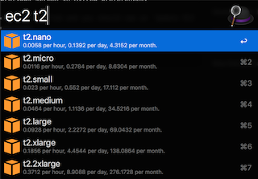

# EC2 Price Lookup Workflow

### How to install

* Install `jq` (`brew install jq`)
* Download the `Ec2.Price.Lookup.alfredworkflow` file from the [releases page](../../releases), then drag it into the workflows screen in Alfred preferences.

### How to use

##### Note that this workflow defaults to grabbing pricing information for Linux instances in US East (N. Virginia).  You can alter this behavior by using the `Set AWS Region` and `Set EC2 System` options when autocompleting `ec2`, or you can edit these variables for the workflow on Alfred's workflow preferences screen.  You need to use the full awful name of each region (e.g. US East (N. Virginia)) because that's how it is in the pricing data.  If you change these, you need to run `Update EC2 Pricing Data` again.

Once installed, you need to have it fetch the latest prices for you.  Type `ec2` into Alfred and you should see an `Update EC2 Pricing Data` option, select it.  You'll get an macOS notification when it completes.  You can run this whenever you want to fetch the latest pricing.

Now that you have the pricing data downloaded, you can try autocompleting an EC2 instance class (`ec2 t2`).  You should see a set of results pop up.

If you highlight an option and hold `cmd`, you'll see memory, vCPUs, and storage for that instance type.  If you hold `shift`, you'll see CPU clock and networking speed.

### How to help make this not a crappy hacky solution

This workflow uses composer to manage deps.  Clone the repo, run `composer install`, add it to Alfred and you should be able to hack away.

## How is this workflow versioned?

This workflow follows the principles of [Semantic Versioning](http://semver.org/). You can find each new release,
along with the changelog, in the [Releases Page](../../releases).
